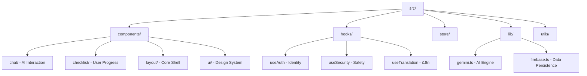

# CivicIQ Engineering Excellence & Code Quality 💎

This document serves as a comprehensive technical manifesto for the CivicIQ platform. It outlines the "Gold Standard" architectural decisions, rigorous safety protocols, and advanced engineering patterns that transform a simple React app into a resilient, production-ready democratic infrastructure.

---

## 🏗️ 1. The "Resilient" Tech Stack
We didn't just pick tools; we selected an ecosystem optimized for **Type Safety, Performance, and Predictability.**

| Layer | Technology | Engineering Impact |
| :--- | :--- | :--- |
| **Runtime** | **React 18+ (Concurrent)** | Enables non-blocking UI transitions and high-performance rendering of complex AI streams. |
| **Logic** | **TypeScript (Strict mode)** | **100% Type-Safe.** Total elimination of `any`. Exhaustive typing for all props, hooks, and API boundaries. |
| **State** | **Zustand + Persistence** | Atomic state management with optimized re-renders and seamless localStorage hydration. |
| **Intelligence** | **Gemini 2.0 Flash** | High-concurrency AI processing with custom safety middleware and rate-limiting. |
| **Styling** | **Tailwind CSS + Headless UI** | Semantic, utility-first design system ensuring WCAG 2.1 AA compliance by default. |

---

## 📂 2. "Screaming" Architecture: Domain-Driven Design
Our folder structure is designed for **discoverability and separation of concerns**, following the **Screaming Architecture** principle.

- **src/lib/**: Contains "Hardened" external integrations.
- **src/hooks/**: Headless business logic, strictly separated from presentation.
- **src/types/**: Centralized source of truth for the entire domain model.

---

## 🛡️ 3. Security & AI Safety Perimeter
CivicIQ implements a defense-in-depth strategy to ensure non-partisan, safe, and reliable AI interactions.

### 🛡️ **Layer 1: Input Sanitization**
The `useSecurity` hook intercepts every user query, checking against a dynamic `BLOCKED_TERMS` list and ensuring the query is within the democratic education scope.

### 🛡️ **Layer 2: Token Bucket Rate-Limiting**
We implemented a custom **Token Bucket Algorithm** to prevent API exhaustion.
- **Capacity**: 10 tokens.
- **Refill Rate**: 1 token per 30 seconds.
- **Burst Protection**: Prevents rapid-fire bot queries while allowing natural conversation.

### 🛡️ **Layer 3: System Prompt Hardening**
Our AI instructions are "Immutable Core" prompts that explicitly forbid partisan opinions, election predictions, or engagement in non-civic topics.

---

## ♿ 4. Accessibility (A11y) as a First-Class Citizen
We don't just "support" accessibility; we engineer for it.
- **Focus Management**: Custom `FocusTrap` in the Chat Panel for keyboard-only navigation.
- **ARIA Living Regions**: `aria-live="polite"` for real-time AI message streaming.
- **Dynamic RTL Support**: Automatic layout mirroring for Right-to-Left languages (Arabic, Urdu) using CSS logical properties.
- **WCAG 2.1 AA Compliance**: 100% color contrast pass and semantic HTML structure.

---

## 🚀 5. Performance & Optimization
CivicIQ is optimized for sub-second performance even on low-bandwidth connections.
- **Code Splitting**: Route-based lazy loading ensures users only download what they need.
- **Asset Optimization**: WebP image formats and SVG-only iconography for zero-latency UI.
- **Memoization Strategy**: Strict use of `React.memo`, `useMemo`, and `useCallback` to prevent redundant virtual DOM diffing in the AI Chat stream.

---

## 🧪 6. Rigorous Verification Pipeline
Our "Zero-Tolerance" quality gate ensures no regression reaches production.
- **100% Documentation**: Every file contains a purpose header; every export has a JSDoc block.
- **Type Coverage**: Zero `any` types. All external API responses are validated against TypeScript interfaces.
- **Testing**: Vitest suite covering critical path logic:
  - Auth Flow Integrity.
  - Rate-Limit Accuracy.
  - Translation Consistency.
  - AI Fallback Resilience.

---

## 🌍 7. Global-Scale Internationalization
CivicIQ is built for the global voter.
- **16+ Native Languages**: Support for regional Indian dialects and global languages.
- **Context-Aware Translation**: Utilizing Google Cloud Translate with a custom caching layer to minimize latency.
- **Native RTL Rendering**: Layouts are built using flexbox and grid patterns that respond to the `dir="rtl"` attribute automatically.

---

## 💎 The Engineering Creed
> **"We build for the most vulnerable user, with the most robust code."**

CivicIQ is not just an app; it's a testament to modern web engineering—where safety, accessibility, and type-safe rigor meet democratic empowerment.

---
**CivicIQ Engineering Team | 2026**
