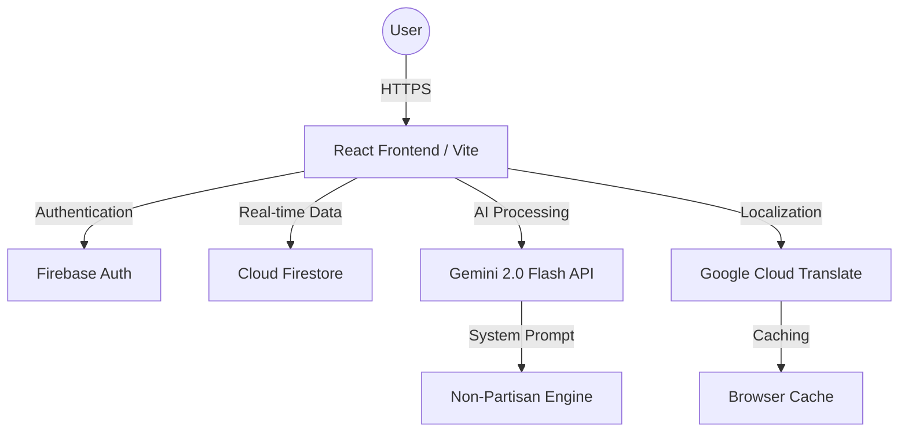

# CivicIQ System Architecture & Design 🏗️

This document provides a high-level overview of the technical architecture, data flow, and integration patterns that power the CivicIQ platform.

---

## 1. High-Level Architecture

CivicIQ is built as a **Serverless Progressive Web Application (PWA)**, leveraging a suite of Google Cloud and Firebase services to ensure global scalability, low latency, and high availability.

---

## 2. The AI Pipeline (Safe-Inference Flow)

The journey of a user prompt through our non-partisan intelligence engine:

1.  **Ingress**: User submits a query via the `ChatPanel`.
2.  **Sanitization**: `useGemini` hook checks the query against `BLOCKED_TERMS` (e.g., candidate names, partisan topics).
3.  **Context Injection**: The `SYSTEM_PROMPT` is prepended to the user's message, enforcing neutrality and educational scope.
4.  **Inference**: The request is sent to **Gemini 2.0 Flash** for high-speed, factual inference.
5.  **Localization**: If the user's language is not English, the response is routed through `Cloud Translate`.
6.  **Egress**: The sanitized, localized, and factual response is streamed back to the UI.

---

## 3. State Management & Persistence

CivicIQ uses a hybrid state model to balance performance with reliability.

| State Type | Management | Persistence Strategy |
| :--- | :--- | :--- |
| **Authentication** | `useAuth` + `authStore` | Synchronized with Firebase Auth state. |
| **Election Progress** | `useTimeline` + `timelineStore` | Real-time sync with Cloud Firestore on a per-user basis. |
| **Civic Checklist** | `useChecklist` + `checklistStore` | Optimistic UI updates with Firestore persistence. |
| **Localization** | `useLanguageStore` | Persisted in `localStorage` for immediate load-time rendering. |

---

## 4. Security & Rate-Limiting Design

To protect our AI resources and ensure platform stability, we implement a **Client-Side Token Bucket Algorithm**:

-   **Bucket Capacity**: 30 tokens (for AI queries).
-   **Refill Rate**: 1 token per 30 seconds.
-   **Enforcement**: The `useRateLimit` hook intercepts all `sendMessage` calls. If the bucket is empty, the UI provides a friendly "Cooling down" message, preventing API spamming and resource exhaustion.

---

## 5. Deployment & CI/CD Pipeline

CivicIQ is optimized for **Google Cloud Run** deployment:

-   **Containerization**: Docker-optimized build producing a lightweight Nginx container.
-   **CI/CD**: Automatic builds via **Google Cloud Build** triggered on every push to the `main` branch.
-   **Global CDN**: Assets are served via Firebase Hosting/Cloud CDN to ensure sub-second TTFB (Time to First Byte) globally.

---
**CivicIQ — Architecting the Future of Civic Engagement.**
