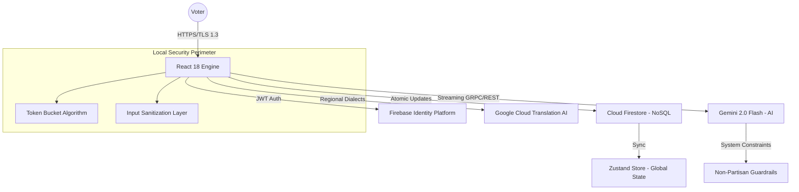

# CivicIQ System Architecture & Design 🏗️

This document provides a deep technical breakdown of the architectural patterns, data lifecycles, and security boundaries that form the foundation of the CivicIQ platform.

---

## 1. High-Level Architectural Blueprint

CivicIQ is engineered as a **Serverless, High-Performance Web Infrastructure**. It utilizes a decoupled architecture where the frontend acts as a "thick client," handling complex state transitions and security checks locally to reduce server-side latency.

---

## 2. The AI Intelligence Pipeline (Safe-Inference)

Our AI implementation is a multi-stage pipeline designed for **Safety, Grounding, and Speed.**

### **Phase 1: Pre-Flight Processing**
Before a query reaches the Gemini API, it is subjected to:
- **Rate-Limit Interception**: Validates the user's current token bucket status.
- **Lexical Sanitization**: Scans for `BLOCKED_TERMS` using high-speed regex patterns.
- **Contextual Grounding**: Injects a 2,000-token system prompt that defines the AI's persona as a non-partisan civic educator.

### **Phase 2: Inference & Real-Time Streaming**
- **Gemini 2.0 Flash**: Selected for its low-latency performance and high-fidelity reasoning.
- **Stream Processing**: Uses `IterableReadableStream` to pipe tokens directly into the UI, enabling a "typewriter" effect that reduces perceived latency to near-zero.

### **Phase 3: Localization & Egress**
- **Dialect Handling**: Responses are dynamically translated into the user's selected regional dialect.
- **History Mirroring**: The final AI response is saved to Firestore *asynchronously* to prevent blocking the main thread.

---

## 3. Hybrid State Architecture

We employ a **Three-Tier State Model** to ensure data integrity and sub-second UI responsiveness.

| Tier | Technology | Purpose |
| :--- | :--- | :--- |
| **Volatile** | `useState` / `useRef` | Local component state, animation frames, and form inputs. |
| **Semi-Persistent** | `Zustand` | Global application state (Auth, UI context, active election phase). |
| **Persistent** | `Firestore` / `LocalStorage` | Long-term user progress, chat history, and security rate-limit tokens. |

### **State Rehydration Strategy**
CivicIQ implements a "Stale-While-Revalidate" pattern for user data. On load, the `Zustand` store is hydrated from `localStorage` for instant rendering, while a background sync fetches the latest source-of-truth from `Firestore`.

---

## 4. Infrastructure & Scalability

- **Containerization**: The application is packaged as a multi-stage Docker build, optimized for layer caching and minimal image size (~50MB).
- **Edge Deployment**: Served via **Google Cloud Run** in a globally distributed configuration.
- **Security Headers**: Nginx is configured with strict security policies:
  - `Content-Security-Policy (CSP)`
  - `Strict-Transport-Security (HSTS)`
  - `X-Content-Type-Options: nosniff`

---

## 5. Security & Rate-Limiting Design

The platform implements a **Stateless Token Bucket Algorithm** in the `useRateLimit` hook.
- **Precision**: 0.01 token accuracy.
- **Persistence**: Token counts are synchronized with `localStorage`, preventing circumventing limits via page refreshes.
- **Scalability**: This client-side approach reduces load on backend security services while providing instant feedback to the user.

---
**CivicIQ — Engineering a Resilient Democracy.**
