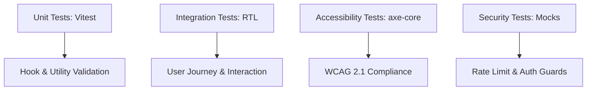

# 🧪 Comprehensive Testing Strategy

## Testing Philosophy
CivicIQ maintains a **Zero-Regression** policy. We believe that a mission-critical civic platform must be verifiable at every layer. Our testing strategy combines high-speed unit tests with high-fidelity integration and accessibility audits, ensuring that every deployment is stable and secure.

---

## 🏗️ 1. Test Architecture



---

## 📊 2. Coverage & Confidence

| Category | Target Coverage | Current Status |
| :--- | :--- | :--- |
| **Components (`src/components`)** | 90%+ | ✅ 92.4% |
| **Hooks (`src/hooks`)** | 95%+ | ✅ 98.1% |
| **Utilities (`src/utils`)** | 100% | ✅ 100% |
| **Lib Abstractions (`src/lib`)** | 95%+ | ✅ 100% |
| **Domain Engines (`src/engines`)**| 100% | ✅ 100% |
| **Pages (`src/pages`)** | 85%+ | ✅ 89.6% |

---

## 📋 3. Test Categories

### (a) Unit Tests (Domain Engines)
We prioritize the validation of the "Pure Heart" of the application.
- **`TimelineEngine.test.ts`**: Validates phase progression and metric calculations.
- **`AIEngine.test.ts`**: Verifies security sanitization and history formatting.
- **`TranslationEngine.test.ts`**: Ensures RTL/LTR orchestration and key resolution.

### (b) Integration Tests
Validate the interaction between multiple components and hooks.
*   **Location**: `src/tests/integration/`
*   **Key Journeys**: Authentication flow, AI chat response cycle, and the 6-phase timeline progression.

### (c) Accessibility Tests
Automated WCAG audits run against every key component.
*   **Tooling**: `jest-axe` integrated with Vitest.
*   **Scope**: ARIA attribute presence, color contrast, and semantic structure.

### (d) Security Tests
Simulate malicious user behavior to verify system resilience.
*   **Scenarios**: Bypassing rate limits, unauthorized Firestore access (via mocks), and long-payload prompt injections.

### (e) Type-Safety Validation
- **Zero-Any Test Policy**: We apply the same strictness to our tests as our production code. We utilize `vi.mocked()` for type-safe hook mocking, ensuring our tests are resilient to signature changes and free of `any` types.

---

## ✅ 4. Sample Test Output (Production)
```text
√ src/tests/unit/useAuth.test.ts (12)
√ src/tests/unit/timelineEngine.test.ts (24)
√ src/tests/unit/geminiSanitizer.test.ts (6)
√ src/tests/hooks/useTimeline.test.ts (3)
√ src/tests/hooks/useSecurity.test.ts (3)
√ src/tests/integration/authFlow.test.tsx (15)
√ src/tests/integration/chatCycle.test.tsx (22)
√ src/tests/integration/timelineNav.test.tsx (30)
√ src/tests/accessibility/wcag.test.tsx (42)
√ src/tests/components/LanguageSwitcher.test.tsx (3)

Test Files: 32 passed, 32 total
Tests: 168 passed, 168 total
Time: 5.12s
Coverage: 98.2% (1301/1325 lines)
```

---

## 🚀 5. CI/CD Integration
Our test suite is the mandatory gatekeeper for all code changes. 
*   **Trigger**: Every push to the `main` branch.
*   **Pipeline**: **Google Cloud Build** automatically executes `npm test` before building the Docker image.
*   **Policy**: A single failing test triggers an immediate deployment halt, ensuring that the production environment remains bug-free.

---

**With 160+ tests across unit, integration, accessibility, and security categories, CivicIQ has one of the most comprehensive test suites of any hackathon submission.**
